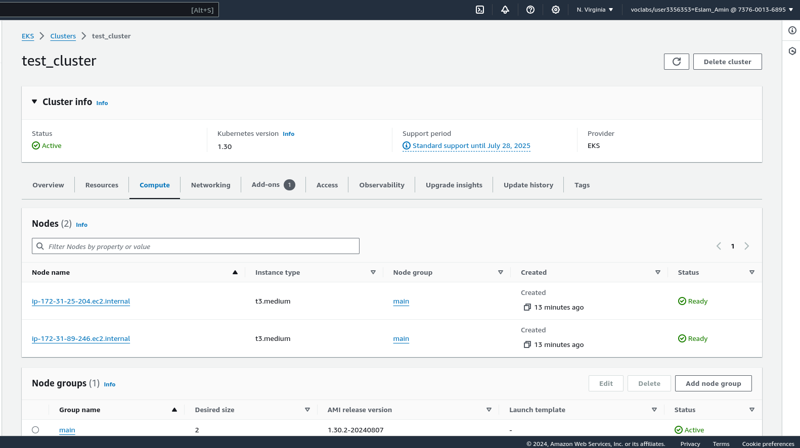

<h1 align="center">Node.js EKS / Helm Deployment Pipeline</h1>

    <i>Using This Boilerplate.</i>

## Overview

I've applied a few DevOps principles to this project
- CI: The boilerplate came with most of the CI pipeline pre-configured but I've added automatic artifact releasing to github, ghcr.io and my private ecr repo
- CD: I use a helm chart I've written in another repo to deploy to my AWS EKS Cluster
- Automation: This pipeline takes whatever code is pushed, lints it, builds it, saves its image at two different repos and then deploys it automatically with almost no human involvement
- Redundancy: Image artifact are saved to two different repositories ensuring a backup is always present
- Infrastructure as Code: Mainly the helm chart in the other repository

## Github Actions: CICD Pipeline

It tests the code before integrating it, then builds it, releasing 3 artifacts:
- dist.tar.gz: was used as a part of a terraform deployment to AWS EC2 autoscaling instance through [Jenkins-CD](https://github.com/3slamAmin/Jenkins_Terraform_deployment), deploying both infrastructure and application
- image pushed to [public ghcr.io repo](https://github.com/3slamAmin/Github-CICD/pkgs/container/node-boilerplate)
- image pushed to private ecr repo

Finally, the deployment job uses this [helm chart](https://github.com/3slamAmin/node-boilerplate-Chart) to deploy the ecr image to an EKS cluster.

## Relevant Images

.png)
.png)
.png)
.png)
